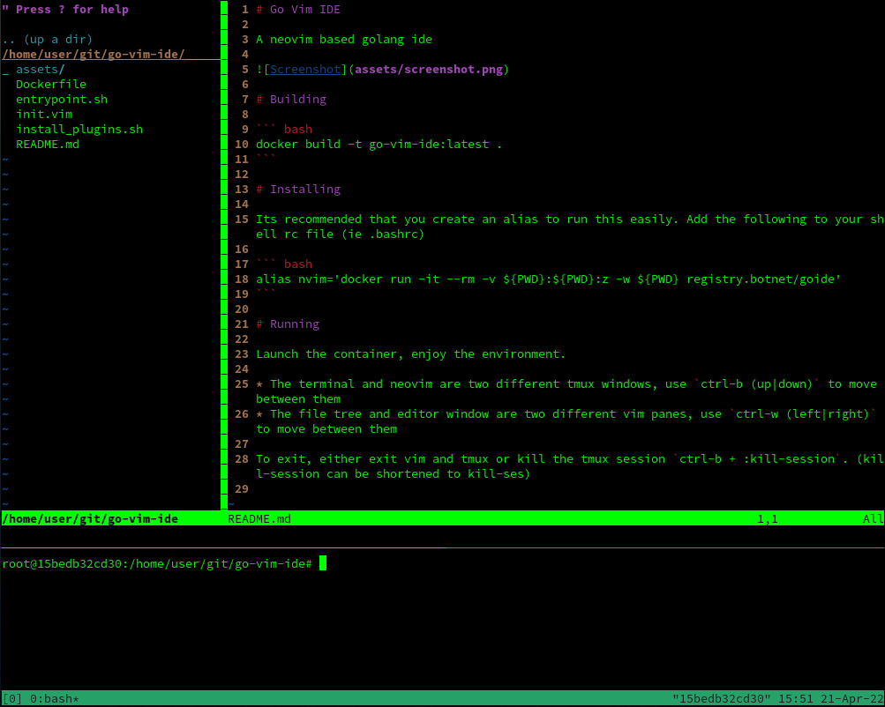

# Go Vim IDE

A neovim based golang ide



# Building

``` bash
docker build -t go-vim-ide:latest .
```

# Installing

Its recommended that you create an alias to run this easily. Add the following to your shell rc file (ie .bashrc)

``` bash
alias nvim='docker run -it --rm -v ${PWD}:${PWD}:z -w ${PWD} registry.botnet/goide'
```

# Running

Launch the container, enjoy the environment.

* The terminal and neovim are two different tmux windows, use `ctrl-b (up|down)` to move between them
* The file tree and editor window are two different vim panes, use `ctrl-w (left|right)` to move between them

To exit, either exit vim and tmux or kill the tmux session `ctrl-b + :kill-session`. (kill-session can be shortened to kill-ses)

